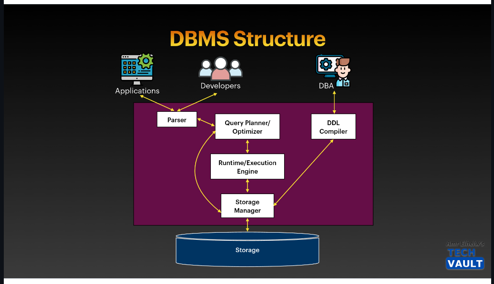
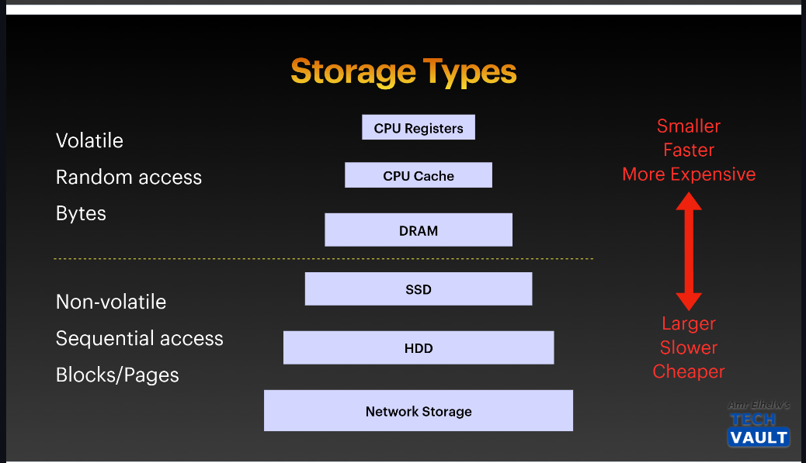
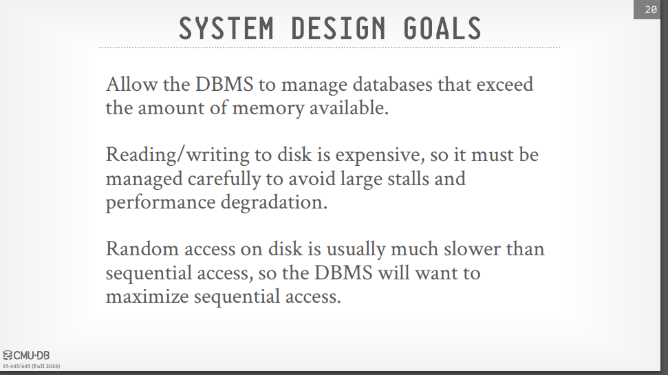
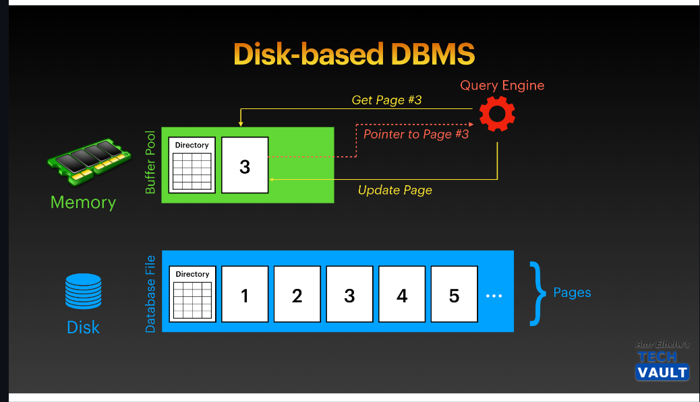
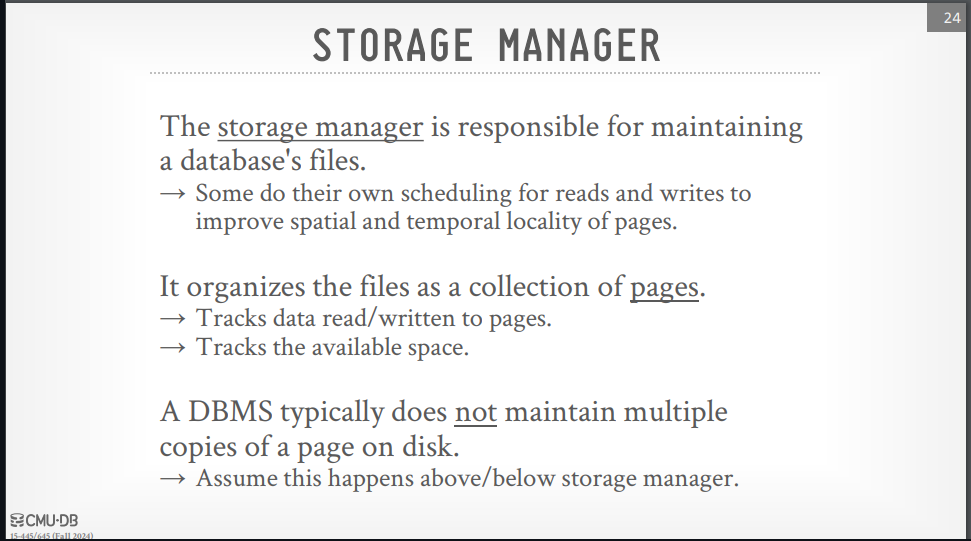
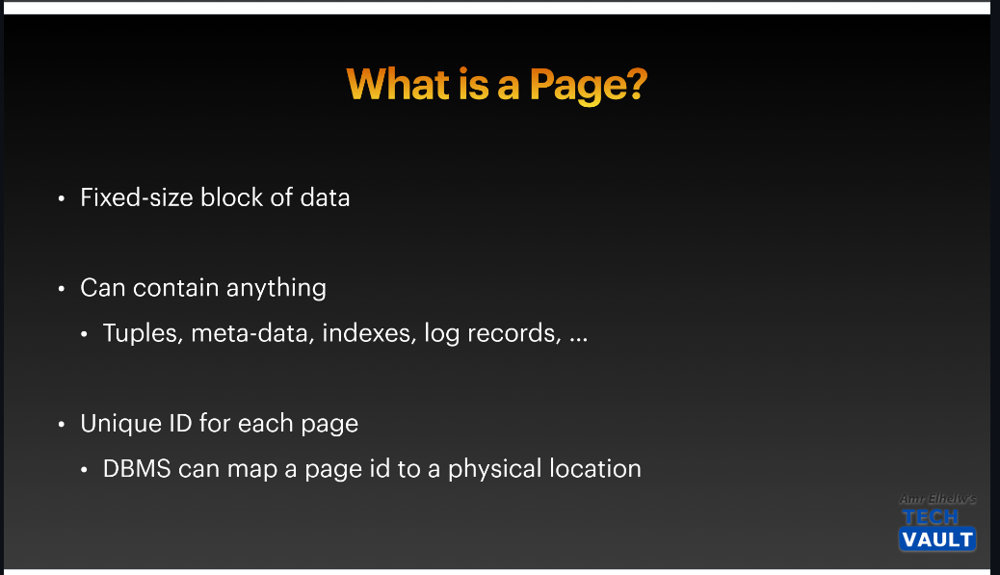
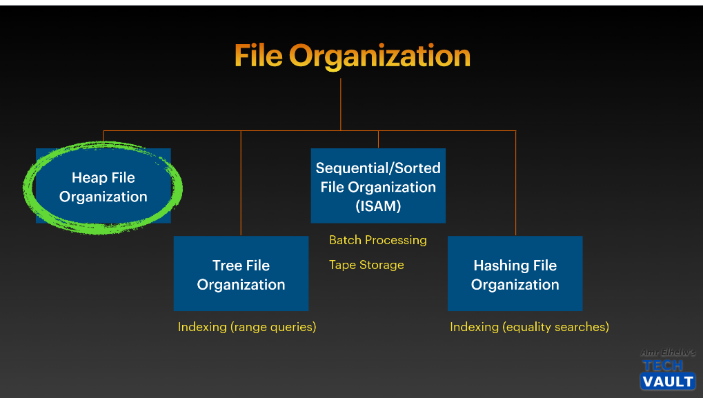
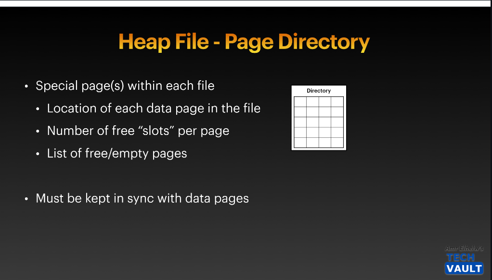

# Database Storage - Part 1 

# Contents
 

1. [DBMS Structure](#dbms-structure)
2. [Storage Types](#storage-types)
3. [Data Movement](#data-movement)
4. [Files & Pages](#files--pages)
5. [File Organization](#file-organization)
6. [Heap Files](#heap-files)

--- 

# DBMS Structure

Database architecture encompasses the various components of a database system and their interconnections. It is influenced by the underlying computer system and can be categorized into different types

---
>> **To learn more about DBMS in detail, check out this link
[DBMS Structure in Detail](https://github.com/OsamaRab3/CMU-Database-Notes/blob/main/01%20-%20Relational%20Model%20%26%20Algebra.md#database-architecture)**

# Storage Types

> Note => The DBMS assumes that the primary storage location of the database is on non-volatile disk.
> 
> The DBMS's components manage the movement of data between non-volatile and volatile storage.

## Volatile Devices:
-  Volatile means that if you pull the power from the machine, then the data is lost.
-  Volatile storage supports fast random access with byte-addressable locations. This means that the
program can jump to any byte address and get the data that is there.
-  For our purposes, we will always refer to this storage class as “memory.”
--- 

## Non-Volatile Devices:
- Non-volatile means that the storage device does not require continuous power in order for the device
to retain the bits that it is storing.
-  It is also block/page addressable. This means that in order to read a value at a particular offset, the
program first has to load the 4 KB page into memory that holds the value the program wants to read.
-  Non-volatile storage is traditionally better at sequential access (reading multiple contiguous chunks
of data at the same time).
-  We will refer to this as “disk.” We will not make a (major) distinction between solid-state storage
(SSD) and spinning hard drives (HDD).

## System Design Goals

---

# Data Movement

## Overview
In a disk-oriented Database Management System (DBMS), all data is stored on disk and organized into pages. The first page is designated as the directory page, which helps manage the data layout.

## Key Components

1. **Buffer Pool**:
   - The buffer pool is responsible for managing the movement of data between disk and memory.
   - When the execution engine needs to operate on data, it requests specific pages from the buffer pool.

2. **Execution Engine**:
   - The execution engine processes queries and relies on the buffer pool to provide access to the required pages.
   - It receives a pointer to the page in memory, allowing it to perform operations on that data.

3. **Data Management**:
   - The buffer pool manager ensures that the requested page remains available in memory while the execution engine operates on it.

# Files & Pages

In its most basic form, a DBMS stores a database as files on disk. Some may use a file hierarchy, while others may use a single file (e.g., SQLite). The operating system does not know anything about the contents of these files. Only the DBMS understands how to decipher their contents, as it is encoded in a way specific to the DBMS.

The DBMS’s storage manager is responsible for managing a database’s files. It represents the files as a collection of pages and keeps track of what data has been read and written to these pages, as well as how much free space exists in them.

--- 

## Database Pages

The DBMS organizes the database into fixed-size blocks of data known as pages. These pages can contain various types of data (e.g., tuples, indexes), and most systems do not mix these types within the same page. Some systems require that pages be self-contained, meaning all necessary information to read a page is contained within it.

### Types of Pages
There are three types of pages in a DBMS:

1. **Hardware Page**: Typically 4 KB.
2. **OS Page**: Usually 4 KB.
3. **Database Page**: Ranges from 1 to 16 KB.

# File Organization

In database systems, organizing records in files is crucial for efficient data access and management. This document outlines several methods for organizing records in files.

## 1. Heap File Organization
- **Definition**: Any record can be placed anywhere in the file where there is available space.
- **Characteristics**: There is no specific order of records, and typically, there is either a single file or a set of files for each relation.

## 2. Sequential File Organization
- **Definition**: Records are stored in a sequential order based on the value of a "search key" of each record.
- **Characteristics**: This organization allows for efficient retrieval based on the search key.

## 3. Multitable Clustering File Organization
- **Definition**: Unlike traditional methods where records of each relation are stored in separate files, this organization stores records of multiple relations within the same file, and often in the same block.
- **Purpose**: Reduces the cost of certain join operations by clustering related records together.

## 4. B+-Tree File Organization
- **Definition**: An advanced method of sequential file organization that supports efficient ordered access even with frequent insert, delete, and update operations.
- **Benefits**: Provides efficient access to specific records based on the search key while maintaining order despite ongoing modifications.

## 5. Hashing File Organization
- **Definition**: A hash function is computed on a specific attribute of each record to determine its placement in the file.
- **Characteristics**: This method is closely related to indexing structures and allows for efficient retrieval of records.

--- 

# Heap Files

## Overview

Heap file organization is a method used in Database Management Systems (DBMS) for locating pages on disk. A heap file is an unordered collection of pages where tuples (records) are stored in a random order.

## Key Characteristics of Heap Files

- **Unordered Collection**: Tuples are inserted into the heap without any specific order.
- **Flexibility**: New tuples can be added easily, making it a flexible option for various types of data.

## Finding Page Locations

To find the location of a page given its page ID, there are two primary methods:

### 1. Signal Order File

- A signal order file maintains an index that tracks the page IDs and their corresponding locations. This allows for faster access to specific pages by referencing the index.
- **Advantages**:
  - Quick retrieval of pages based on their IDs.
- **Use Case**: Ideal for applications with frequent searches for specific records.

### 2. Multiple Order Files

- In this approach, there are multiple files, each potentially sorted or organized differently. Each file can represent different ordering or indexing strategies for the tuples.
- **Advantages**:
  - Provides flexibility in accessing data based on different criteria (e.g., by date, category, etc.).
- **Use Case**: Useful in complex databases where different queries require varying access paths.

--- 

## Page Directory

A **Page Directory** is used to keep track of the pages in the heap file. It serves as a mapping structure that provides information about where each page is stored. This structure aids in efficient data retrieval and management.

