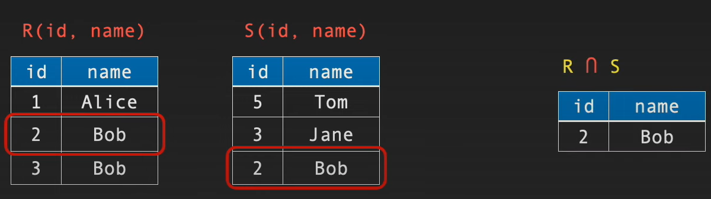

There are different kinds of databases:
- `Relarional databases(SQL)`
- `Graph`
- `Key-Value`
- `Column Store`
***
#### Relational Database
-  Consist of `Tables`,  each table represent a relation
- Relational algebra is procedural
- Table consist of `Rows/Tuples`
- Each row has a unique `id` , distinguish this row
- row = tuples = record && Table = Relation

***
### Relational Database Operations
Select ( σ ) :
 -  هختار جدول  من schema بناءاً علي condition محددة
- لاحظ إن الناتج عبارة عن جدول بردو م Columns معينة لا.

| EmployeeID | Name    | Department | Salary |
|------------|---------|------------|--------|
| 1          | Alice   | Sales      | 60000  |
| 2          | Bob     | HR         | 50000  |
| 3          | Charlie | IT         | 70000  |
| 4          | David   | Sales      | 55000  |

**`σcondition​(Relation)`**
`σDepartment = ’Sales’​(Employee)`
لاحظ هنا أنا هعمل select لجدول الـموظفين اللي شغالين في قسم المبيعات فقط

***

Rename ( ρ )
- بتغير أسم table أو attributes في output

**syntax**:
`ρNewRelationName(NewColumn1,NewColumn2,...)​(Relation)`

**Example**

| EmployeeID | Name    | Department | Salary |
|------------|---------|------------|--------|
| 1          | Alice   | Sales      | 60000  |
| 2          | Bob     | HR         | 50000  |
| 3          | Charlie | IT         | 70000  |
| 4          | David   | Sales      | 55000  |

`ρStaff(ID,Name,Department)​(Employee)` = 

| EmployeeID | Name    | Department | Salary |
|------------|---------|------------|--------|
| 1          | Alice   | Sales      | 60000  |
| 2          | Bob     | HR         | 50000  |
| 3          | Charlie | IT         | 70000  |
| 4          | David   | Sales      | 55000  |'

- The result is that the relation **Employee** is now referred to as **Staff**.

 ***
 
 Projection ( **π** )
 - بتختار Columns معينة من الجدول هي تكون output
 `π(Column1, Column2, ...)(Relation)`
  
| EmployeeID | Name    | Department | Salary |
|------------|---------|------------|--------|
| 1          | Alice   | Sales      | 60000  |
| 2          | Bob     | Sales      | 60000  |
| 3          | Charlie | IT         | 70000  |
| 4          | David   | Sales      | 55000  |

`πName, Department​(Employee)`
`πSalary​(σDepartment=′Sales′​(Employee))
 - لاحظ نقطة هنا إن Relational database م بتقبل بتكرار القيم يعني أي؟
   يعني ناتج Column اللي هتطلع هيحذف منه أي duplicates
    (أي two records شبه بعض تمامًا).
- result of second equation:

| Salary |
| ------ |
| 60000  |

***

Union ( **∪** )
- تعمل إتحاد بين جدولين
- طبعا مفيش row هيكون متكرر في الناتج
- لازم تعمل  Union بين نفس attributes
`Relation1∪Relation2`

***

Intersection ( **∩** )
- طبع القيم المتشابة بين جدولين
- طبعا مفيش row هيكون متكرر في الناتج
- لازم تعمل  Intersection بين نفس attributes
`Relation1∩Relation2`
`R ∩ S`

***

Difference (−)
- طبع الموجود في الجدول الأول و م موجود في التاني
- طبعا مفيش row هيكون متكرر في الناتج
-  لازم تعمل  Difference بين نفس attributes
`Relation1 - Relation2`

***

Product ( X )
- الناتج عبارة عن كل combination الممكنة من الجدولين المضروبين في بعض
- طبعا مفيش row هيكون متكرر في الناتج 
`Relation1 x Relation2`

***

Inner Join (⨝)

- تعمل combination بين الجداول بناءا علي attributes مشتركة بين الجداول دي
- طبعا مفيش row هيكون متكرر في الناتج
`Relation1 ⨝ Relation2`

***
